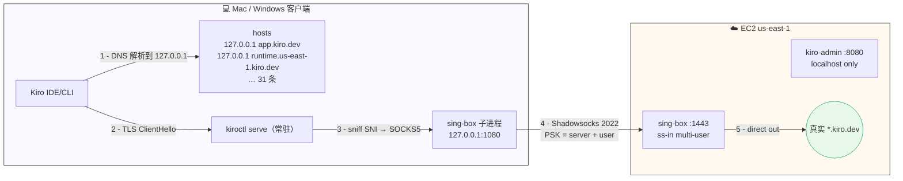

# kiro-proxy

[](https://github.com/memoverflow/kiro/actions/workflows/build.yml)
[](https://github.com/memoverflow/kiro/releases)
[](https://go.dev/)
[](./LICENSE)
[](#install)
[](https://github.com/SagerNet/sing-box)
[](https://github.com/memoverflow/kiro)

> 把 Kiro IDE/CLI 的 21 个白名单域名**强制**经由 AWS us-east-1 的 EC2 出口；**其他流量不受影响**；**EC2 挂了 Kiro 就断开，绝不直连泄漏中国 IP**。

不是 VPN，不是菜单栏工具，不是通用代理。是一个单向的访问控制器。

---

## Table of Contents

- [Features](#features)
- [How it works](#how-it-works)
- [Quick start](#quick-start)
  - [Prerequisites](#prerequisites)
  - [Deploy EC2](#deploy-ec2)
  - [Install admin backend](#install-admin-backend)
  - [Install client (kiroctl)](#install-client-kiroctl)
- [Install](#install)
  - [macOS (Apple Silicon)](#macos-apple-silicon)
  - [Windows (x64)](#windows-x64)
- [Client configuration](#client-configuration)
- [Onboarding a teammate](#onboarding-a-teammate)
- [Architecture](#architecture)
  - [Allowlisted domains](#allowlisted-domains)
  - [Enterprise VPN coexistence](#enterprise-vpn-coexistence)
  - [fail-closed verification](#fail-closed-verification)
- [Security model](#security-model)
- [Cost](#cost)
- [Uninstall](#uninstall)
- [FAQ](#faq)
- [Comparison](#comparison)
- [Contributing](#contributing)
- [License](#license)

---

## Features

- **fail-closed by design** — sing-box 挂、EC2 挂、密钥错 → 白名单域名直接断开，不会 fallback direct
- **只碰 Kiro 域名** — 31 条 hosts 劫持，非白名单流量走系统默认路由
- **企业 VPN 兼容** — 不接管路由表、不装 TUN、不改系统代理设置
- **多用户认证** — Shadowsocks 2022 PSK，任何一人密钥泄漏只影响他
- **自包含二进制** — kiroctl 内嵌 sing-box，端用户单文件安装，不依赖 brew/choco
- **kubectl 风格 config** — `kiroctl config set-user NAME --server=... --psk=...`，支持多 context
- **跨平台** — macOS (Apple Silicon) + Windows (x64)
- **Web UI 管理** — EC2 端提供用户 CRUD、env 下载、审计日志、密钥 rotation
- **审计日志** — EC2 侧 admin 操作 + sing-box 连接日志（journalctl）

## How it works



**TL;DR** — hosts 劫持把白名单域名指向本地 → kiroctl 嗅 SNI → sing-box 以 Shadowsocks 2022 拨到 EC2 → EC2 端 sing-box 直连目标。失败链路上任一环节都不回退 direct。

---

## Quick start

### Prerequisites

本地（管理员）：

```bash
brew install go awscli jq sing-box
aws configure   # IAM user，EC2 + VPC 权限
```

### Deploy EC2

```bash
./scripts/deploy-ec2.sh
```

会：查最新 Ubuntu 24.04 ARM AMI、建 key pair (`~/.ssh/kiro-proxy-key.pem`)、建 SG、起 `t4g.nano`（~$3/月）、装 sing-box。产物：`./.kiro-proxy.env`。

> ⚠️ **SG 白名单必须 /32**。每加一个用户都要在 SG 里加他的公网 IP `/32`（严禁 `0.0.0.0/0`）。

### Install admin backend

```bash
./scripts/install-admin.sh
```

交叉编译 `kiro-admin` for linux/arm64、scp 上去、装 systemd service、初始化 admin 密码、默认创建一个叫 `admin` 的 Shadowsocks 用户。

Web UI 开 SSH 隧道访问：

```bash
source .kiro-proxy.env
ssh -i "$SSH_KEY" -L 8080:127.0.0.1:8080 "ubuntu@$KIRO_EC2_HOST"
# 另开一个终端
open http://127.0.0.1:8080/
```

### Install client (kiroctl)

开发者从源码装：

```bash
./scripts/install-kiroctl.sh
```

或者把 [Release](https://github.com/memoverflow/kiro/releases) 里的自包含二进制发给同事——详见 [Install](#install)。

---

## Install

端用户只需要一个二进制文件，不需要 brew / choco / git / go 工具链。

### macOS (Apple Silicon)

从 [Releases](https://github.com/memoverflow/kiro/releases) 下载 `kiroctl-darwin-arm64`，然后：

```bash
chmod +x ~/Downloads/kiroctl-darwin-arm64
xattr -d com.apple.quarantine ~/Downloads/kiroctl-darwin-arm64 2>/dev/null || true

# 一次性 bootstrap（sudo 密码输一次，自拷到 /usr/local/bin、解压 sing-box、写 sudoers）
./kiroctl-darwin-arm64 install

# 粘贴管理员给你的 context 命令
kiroctl config set-user <name> --server=... --server-key=... --psk=...

sudo kiroctl enable
kiroctl status
```

### Windows (x64)

从 [Releases](https://github.com/memoverflow/kiro/releases) 下载 `kiroctl-windows-amd64.exe`。PowerShell 里：

```powershell
# UAC 弹窗 x1，自拷到 Program Files、解压 sing-box、注册 Service、加防火墙规则、加 PATH
.\kiroctl-windows-amd64.exe install

# 关闭当前 PowerShell，重开一个让 PATH 生效

kiroctl config set-user <name> --server=... --server-key=... --psk=...
kiroctl enable
kiroctl status
```

> ⚠️ **SmartScreen 首次会拦截**。点 "More info" → "Run anyway"。未来有代码签名就消失。
>
> ⚠️ **端口冲突**：如果装了 IIS / Skype / Docker Desktop / HyperV，`:443` 可能被占。用 `netstat -ano | findstr :443` 排查。

---

## Client configuration

kiroctl 用类似 kubectl 的 config 模型，存在 `~/.kiro-proxy/config.json`。

```bash
kiroctl config set-user NAME --server=HOST:PORT --server-key=PSK --psk=PSK [--method=M]
kiroctl config get-contexts
kiroctl config current-context
kiroctl config use-context NAME
kiroctl config delete-context NAME
kiroctl config view                  # PSK / server-key 会自动 redact
```

老的 env 文件方式仍兼容 (`~/.kiro-proxy/config.env`)，config.json 优先级更高。

---

## Onboarding a teammate

1. 在 Web UI 点 **Add user**，填 `alice` + 备注，sing-box 自动 reload
2. 点 alice 那行的 **copy**，把一整条 `kiroctl config set-user alice ...` 命令通过安全通道（Signal / 内部 IM）发给她
3. 手动在 AWS console 或 CLI 给 SG 加她的公网 IP `/32`：TCP 1443 + UDP 1443
4. 她在自己的 Mac / Windows 上按 [Install](#install) 走一遍

### Revoking a user

- Web UI 点他那行的 **delete** → sing-box 自动 reload → 他连不上了
- 手动在 SG 里删他的 IP 规则

### Server key rotation (nuclear option)

**Web UI → Rotate server key** → **所有人的 context 失效**。你下载每人新 context 重发。核级武器，谨慎使用。

---

## Architecture

```
.
├── cmd/
│   ├── kiroctl/           Mac + Windows CLI (install/enable/disable/status/serve/dashboard/config)
│   └── kiro-admin/        EC2 Web UI binary (linux/arm64)
├── pkg/
│   ├── config/            client config loader (kubeconfig-style + env fallback) + 白名单域名清单
│   ├── hosts/             hosts 文件管理（跨平台路径）
│   ├── sni/               SNI 透明代理（ClientHello 解析 + SOCKS5 转发）
│   ├── singbox/           客户端 sing-box config 生成
│   └── admin/             EC2 multi-user 管理（users + audit + HTTP UI + bcrypt auth）
├── scripts/
│   ├── deploy-ec2.sh         EC2 一次性开机
│   ├── install-admin.sh      部署 Web UI 到 EC2
│   ├── install-kiroctl.sh    从源码装 (dev)
│   ├── fetch-singbox.sh      下载 sing-box 官方二进制到 embed/
│   ├── build-dist.sh         产出 dist/kiroctl-{darwin-arm64,windows-amd64.exe}
│   ├── uninstall-kiroctl.sh  客户端卸载
│   └── destroy-ec2.sh        EC2 销毁
└── .github/workflows/build.yml   CI: go vet + 跨平台 build
```

### Allowlisted domains

`pkg/config/domains.go` 里 31 条，严格对应 [Kiro 官方文档](https://kiro.dev/docs/cli/privacy-and-security/firewalls/)。覆盖：

- `*.kiro.dev`（展开成 12 个已知子域）
- AWS Q 后端
- Cognito / OIDC
- IAM Identity Center (`awsapps.com` / `signin.aws`)
- Microsoft Entra
- Stripe
- open-vsx
- GitHub

Kiro 加了新子域名时：改 `pkg/config/domains.go` → `./scripts/install-kiroctl.sh` 重装 → `kiroctl enable` 重载。

### Enterprise VPN coexistence

设计时就考虑了和企业 VPN 共存，关键点：

- **不接管路由表** — 不用 TUN、不做全局代理，任何企业 VPN（Cisco AnyConnect / GlobalProtect 等）的 utun 路由完全不受影响
- **不依赖系统 DNS** — sniffed SNI 直接塞进 Shadowsocks 头，EC2 上解析，企业 Split DNS 污染不了 `*.kiro.dev`
- **不碰 `HTTPS_PROXY`** — Kiro 子进程 / webview 浏览器登录都会走 hosts 劫持
- **不占 utun 编号** — kiroctl 只监听 127.0.0.1 的 TCP 端口

和 Shadowrocket / Clash 之类的机场客户端也不冲突（它们碰 TUN，我们不碰）。

### fail-closed verification

```bash
source .kiro-proxy.env
ssh -i "$SSH_KEY" "ubuntu@$KIRO_EC2_HOST" 'sudo systemctl stop sing-box'

curl https://app.kiro.dev/
# → SSL_ERROR_SYSCALL ✓ 断开，不泄漏

ssh -i "$SSH_KEY" "ubuntu@$KIRO_EC2_HOST" 'sudo systemctl start sing-box'
# 立刻恢复
```

---

## Security model

| 层 | 保护 |
|---|---|
| SG 白名单 `/32` | 只你自己手动加，项目代码不自动改 SG |
| SSH key | `~/.ssh/kiro-proxy-key.pem` 权限 400，不进 git |
| PSK | 每用户 16 字节 base64，Shadowsocks 2022 AEAD 加密认证 |
| Web UI | 只监听 127.0.0.1:8080，必须 SSH 隧道；admin 密码 bcrypt 存储 |
| 客户端 config | `~/.kiro-proxy/config.json` 权限 600，`kiroctl config view` 会 redact |
| `.kiro-proxy.env` | 权限 600，`.gitignore` 里 |
| 审计 | `/etc/kiro-admin/audit.jsonl` — 谁什么时间做了什么 |

---

## Cost

| 项目 | 月费 |
|---|---|
| `t4g.nano` us-east-1 | $3.07 |
| EIP 挂载 | $0 |
| 出站流量（Kiro 日常估 ~15GB/月） | ~$1.35 |
| **合计** | **~$5** |

---

## Uninstall

客户端：

```bash
./scripts/uninstall-kiroctl.sh
```

EC2 整套销毁：

```bash
./scripts/destroy-ec2.sh
```

---

## FAQ

<details>
<summary><b>enable 之后白名单域名报 SSL_ERROR_SYSCALL</b></summary>

- `kiroctl status` 看三项是否都绿
- `sudo tail /var/log/kiroproxy.err.log` 看 sing-box 和 SNI 代理的报错
- 确认 EC2 sing-box 在跑：`ssh ubuntu@<EIP> sudo systemctl status sing-box`
- 确认你的公网 IP 在 EC2 SG 白名单里：`curl https://checkip.amazonaws.com`，对照 EC2 SG
</details>

<details>
<summary><b>Dashboard 404</b></summary>

sing-box 首次启动时下载 metacubexd UI 走 EC2 shadowsocks outbound，需要 3-5 秒。刷新一下，或：

```bash
sudo rm -rf "/Library/Application Support/KiroProxy/ui"
kiroctl disable && kiroctl enable
```
</details>

<details>
<summary><b>Kiro 登录浏览器弹窗卡住</b></summary>

- Kiro 浏览器登录通常在 Kiro 自己的 webview，会走 hosts 劫持 ✓
- 如果是跳到系统 Safari，那些域名也会走 hosts，仍然透明劫持到 kiroctl
- 极端情况：`kiroctl status` 看是不是挂了
</details>

<details>
<summary><b>新网络环境（办公室 → 家）之后连不上</b></summary>

家里公网 IP 变了，EC2 SG 里没你新 IP。手动在 AWS console 或 CLI 更新 SG 规则：

```bash
aws ec2 authorize-security-group-ingress --region us-east-1 --group-id <SG_ID> \
  --ip-permissions \
    "IpProtocol=tcp,FromPort=1443,ToPort=1443,IpRanges=[{CidrIp=$(curl -s checkip.amazonaws.com)/32}]" \
    "IpProtocol=udp,FromPort=1443,ToPort=1443,IpRanges=[{CidrIp=$(curl -s checkip.amazonaws.com)/32}]"
```
</details>

<details>
<summary><b>要加新 Kiro 子域名</b></summary>

改 `pkg/config/domains.go`，重新 `./scripts/install-kiroctl.sh`，然后 `kiroctl disable && kiroctl enable` 生效新白名单。
</details>

<details>
<summary><b>Windows: SmartScreen 拦截 / kiroctl command not found</b></summary>

- SmartScreen：点 "More info" → "Run anyway"。没有代码签名时这是预期行为。
- command not found：PATH 只在**新开**的 PowerShell 里生效。关掉当前窗口重开。
</details>

---

## Comparison

### vs [kasimxiao/kiro-sni-proxy](https://github.com/kasimxiao/kiro-sni-proxy)

那个项目是 nginx SNI 透传 + 客户端改 hosts 指向 EIP，**没有认证**。本项目借鉴了 hosts 劫持的思路，但：

- **强制认证** — Shadowsocks 2022 PSK，没密钥的人发什么包都丢
- **多用户** — 每人独立 PSK，离职 / 泄漏只影响一人
- **审计** — 谁在什么时间做了管理操作都有日志
- **Web UI** — 命令行之外还有图形界面
- **自包含客户端** — 单二进制分发，不用 brew / choco / git
- **Windows 支持** — macOS + Windows 双平台
- **kubectl 风格 config** — 多 context 切换

---

## Contributing

欢迎 issue / PR。项目还在早期，欢迎真机验证——特别是 Windows 侧的 EDR / Defender 行为。

开发流程：

```bash
git clone https://github.com/memoverflow/kiro.git
cd kiro
./scripts/fetch-singbox.sh    # 下载嵌入用 sing-box 二进制
go build ./...
go vet ./...
```

Commit message 用 [Conventional Commits](https://www.conventionalcommits.org/)：`feat:` / `fix:` / `docs:` / `refactor:` / `chore:`。

### Cutting a release

Releases are fully automated. To cut a new version:

```bash
git tag v0.4.0
git push origin v0.4.0
```

The `release` workflow (`.github/workflows/release.yml`) takes over from there:

1. Cross-compiles `kiroctl-darwin-arm64` and `kiroctl-windows-amd64.exe`
2. Downloads pinned `sing-box` and embeds it into both binaries
3. Generates SHA-256 `checksums.txt`
4. Creates a GitHub Release with auto-generated notes (grouped by `.github/release.yml`)
5. Uploads all three assets

Tag format must be SemVer-ish (`v<MAJOR>.<MINOR>.<PATCH>`). Pre-releases like `v0.4.0-rc1` also work.

---

## License

[MIT](./LICENSE) © 2026 Lucas
